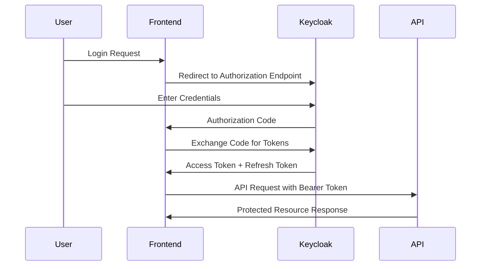

# Frontend Integration Guide

This guide explains how to integrate frontend applications (Angular, React, Vue, etc.) with the Grants Applicant Portal API.

## Overview

The API is designed to support both direct API access and frontend applications through:
- **JWT Bearer Token Authentication** via Keycloak OIDC
- **CORS Support** for browser-based applications
- **RESTful API Design** with clear endpoints
- **Role-based Authorization** that maps to frontend permissions

## Authentication Flow for Frontend Applications

### 1. Keycloak OIDC Integration

Frontend applications should integrate directly with Keycloak using the Authorization Code flow with PKCE:

#### Keycloak Configuration
- **Authorization Endpoint**: `https://your-keycloak-server.com/auth/realms/your-realm/protocol/openid-connect/auth`
- **Token Endpoint**: `https://your-keycloak-server.com/auth/realms/your-realm/protocol/openid-connect/token`
- **UserInfo Endpoint**: `https://your-keycloak-server.com/auth/realms/your-realm/protocol/openid-connect/userinfo`
- **Client ID**: `your-client-id`
- **Response Type**: `code`
- **Grant Type**: `authorization_code`

#### Recommended Libraries
- **Angular**: `angular-oauth2-oidc` or `@auth0/angular-jwt`
- **React**: `oidc-client-ts` or `@auth0/auth0-react`
- **Vue**: `vue-oidc-client` or `@auth0/auth0-vue`

### 2. Frontend Authentication Flow



### 3. Token Management

#### Storing Tokens
```javascript
// Store tokens securely
localStorage.setItem('access_token', accessToken);
localStorage.setItem('refresh_token', refreshToken);

// Or use sessionStorage for better security
sessionStorage.setItem('access_token', accessToken);
```

#### Making API Calls
```javascript
// Add Authorization header to all API requests
const token = localStorage.getItem('access_token');

fetch('/api/profiles/123', {
    method: 'GET',
    headers: {
        'Authorization': `Bearer ${token}`,
        'Content-Type': 'application/json'
    }
})
.then(response => response.json())
.then(data => console.log(data));
```

## Frontend Authorization Patterns

### 1. Route Guards (Angular Example)

```typescript
@Injectable()
export class AuthGuard implements CanActivate {
    constructor(private auth: AuthService) {}

    canActivate(): boolean {
        if (this.auth.isAuthenticated() && this.auth.hasRole('user')) {
            return true;
        }
        
        this.auth.login();
        return false;
    }
}

// Admin-only routes
@Injectable()
export class AdminGuard implements CanActivate {
    constructor(private auth: AuthService) {}

    canActivate(): boolean {
        return this.auth.isAuthenticated() && this.auth.hasRole('admin');
    }
}
```

### 2. Component-Level Authorization (React Example)

```jsx
import { useAuth } from './auth-context';

function ProfileComponent() {
    const { user, hasRole } = useAuth();

    if (!user) {
        return <LoginPrompt />;
    }

    return (
        <div>
            <h1>Welcome, {user.preferred_username}</h1>
            
            {hasRole('admin') && (
                <AdminPanel />
            )}
            
            {hasRole('grant-officer') && (
                <ReviewApplicationsButton />
            )}
            
            {hasRole('user') && (
                <SubmitApplicationButton />
            )}
        </div>
    );
}
```

### 3. API Service with Role Mapping (TypeScript)

```typescript
export class ApiService {
    private baseUrl = '/api';
    
    constructor(private auth: AuthService) {}

    private getHeaders(): HeadersInit {
        const token = this.auth.getAccessToken();
        return {
            'Authorization': `Bearer ${token}`,
            'Content-Type': 'application/json'
        };
    }

    // Profile operations
    async getProfile(profileId: string): Promise<Profile> {
        const response = await fetch(`${this.baseUrl}/profiles/${profileId}`, {
            headers: this.getHeaders()
        });
        return response.json();
    }

    // Admin-only operations
    async getAllUsers(): Promise<User[]> {
        if (!this.auth.hasRole('admin')) {
            throw new Error('Insufficient permissions');
        }
        
        const response = await fetch(`${this.baseUrl}/admin/users`, {
            headers: this.getHeaders()
        });
        return response.json();
    }

    // Grant officer operations
    async reviewApplication(applicationId: string, decision: string): Promise<void> {
        if (!this.auth.hasRole('grant-officer') && !this.auth.hasRole('admin')) {
            throw new Error('Insufficient permissions');
        }
        
        await fetch(`${this.baseUrl}/applications/${applicationId}/review`, {
            method: 'POST',
            headers: this.getHeaders(),
            body: JSON.stringify({ decision })
        });
    }
}
```

## Role Mapping Between API and Frontend

The API authorization policies map directly to frontend permissions:

### Basic Policies
- **`RequireAuthenticatedUser`** ? Frontend: `isAuthenticated()`
- **`RequireRealmRole`** ? Frontend: `hasAnyRole()`

### Role-Based Policies
- **`AdminOnly`** ? Frontend: `hasRole('admin')`
- **`SystemAdmin`** ? Frontend: `hasRole('system-admin')`
- **`ProgramManager`** ? Frontend: `hasRole('program-manager')`
- **`GrantOfficer`** ? Frontend: `hasRole('grant-officer')`

### Resource-Based Policies
- **`CanReadProfiles`** ? Frontend: Show profile views
- **`CanManageProfiles`** ? Frontend: Show profile edit buttons
- **`CanSubmitApplications`** ? Frontend: Show application forms
- **`CanReviewApplications`** ? Frontend: Show review interface
- **`CanManageSystem`** ? Frontend: Show admin panels

### Business Logic Policies
- **`RequireVerifiedEmail`** ? Frontend: Show email verification prompt
- **`RequireCompleteProfile`** ? Frontend: Show profile completion wizard
- **`FullyVerifiedUser`** ? Frontend: Enable full application functionality

## Example Frontend Implementation

### Auth Service (Angular)

```typescript
@Injectable({ providedIn: 'root' })
export class AuthService {
    private tokenSubject = new BehaviorSubject<string | null>(null);
    private userSubject = new BehaviorSubject<any>(null);

    constructor(private http: HttpClient) {
        this.loadTokenFromStorage();
    }

    login(): void {
        // Redirect to Keycloak
        const authUrl = 'https://your-keycloak-server.com/auth/realms/your-realm/protocol/openid-connect/auth';
        const params = new URLSearchParams({
            client_id: 'your-client-id',
            response_type: 'code',
            scope: 'openid profile email',
            redirect_uri: window.location.origin + '/auth/callback'
        });
        
        window.location.href = `${authUrl}?${params}`;
    }

    async handleCallback(code: string): Promise<void> {
        const tokenResponse = await this.exchangeCodeForToken(code);
        this.setTokens(tokenResponse.access_token, tokenResponse.refresh_token);
        
        // Get user info from API
        const userInfo = await this.getUserInfo();
        this.userSubject.next(userInfo);
    }

    isAuthenticated(): boolean {
        const token = this.getAccessToken();
        return token && !this.isTokenExpired(token);
    }

    hasRole(role: string): boolean {
        const user = this.userSubject.value;
        return user?.realmRoles?.includes(role) || false;
    }

    hasAnyRole(roles: string[]): boolean {
        return roles.some(role => this.hasRole(role));
    }

    getAccessToken(): string | null {
        return localStorage.getItem('access_token');
    }

    private async getUserInfo(): Promise<any> {
        const response = await this.http.get('/Auth/userinfo').toPromise();
        return response;
    }
}
```

### HTTP Interceptor (Angular)

```typescript
@Injectable()
export class AuthInterceptor implements HttpInterceptor {
    constructor(private auth: AuthService) {}

    intercept(req: HttpRequest<any>, next: HttpHandler): Observable<HttpEvent<any>> {
        const token = this.auth.getAccessToken();
        
        if (token) {
            const authReq = req.clone({
                setHeaders: {
                    Authorization: `Bearer ${token}`
                }
            });
            return next.handle(authReq);
        }
        
        return next.handle(req);
    }
}
```

## CORS Configuration

The API is configured with CORS support:

### Development
- **Allowed Origins**: Any origin (`*`)
- **Purpose**: Easy development and testing

### Production
- **Allowed Origins**: Specific domains only
  - `https://your-production-domain.com`
  - `https://your-dev-domain.com`
  - `https://your-test-domain.com`
- **Methods**: All HTTP methods
- **Headers**: All headers
- **Credentials**: Supported for authentication

## API Endpoints for Frontend

### Public Endpoints (No Auth Required)
- `GET /System/health` - Health check
- `GET /System/info` - System information

### Authenticated Endpoints
- `GET /Auth/userinfo` - Current user information
- `GET /api/profiles/{id}` - Get profile (requires `CanReadProfiles`)
- `POST /api/profiles/{id}/hydrate` - Hydrate profile (requires `CanManageProfiles`)
- `GET /api/applications` - List applications (role-dependent)
- `POST /api/applications` - Submit application (requires `CanSubmitApplications`)

## Error Handling

### HTTP Status Codes
- **401 Unauthorized**: Token missing or invalid ? Redirect to login
- **403 Forbidden**: Insufficient permissions ? Show error message
- **404 Not Found**: Resource not found ? Show not found page

### Frontend Error Handling
```typescript
async makeApiCall(url: string): Promise<any> {
    try {
        const response = await fetch(url, {
            headers: this.getAuthHeaders()
        });
        
        if (response.status === 401) {
            // Token expired or invalid
            this.auth.logout();
            this.auth.login();
            return;
        }
        
        if (response.status === 403) {
            // Insufficient permissions
            throw new Error('You do not have permission to access this resource');
        }
        
        if (!response.ok) {
            throw new Error(`API call failed: ${response.statusText}`);
        }
        
        return response.json();
    } catch (error) {
        console.error('API call failed:', error);
        throw error;
    }
}
```

## Security Considerations

### Token Storage
- **Development**: localStorage acceptable for ease of use
- **Production**: Consider secure httpOnly cookies or sessionStorage
- **Never**: Store refresh tokens in localStorage in production

### Token Refresh
```typescript
async refreshTokenIfNeeded(): Promise<void> {
    const token = this.getAccessToken();
    
    if (token && this.isTokenExpiringSoon(token)) {
        await this.refreshToken();
    }
}

private isTokenExpiringSoon(token: string): boolean {
    const payload = this.parseJwtPayload(token);
    const expiryTime = payload.exp * 1000;
    const fiveMinutesFromNow = Date.now() + (5 * 60 * 1000);
    
    return expiryTime < fiveMinutesFromNow;
}
```

### CSRF Protection
- API uses stateless JWT tokens (no CSRF risk)
- Ensure tokens are not exposed in URLs or logs

## Testing Frontend Integration

### Unit Tests
```typescript
describe('AuthService', () => {
    it('should identify admin users correctly', () => {
        const authService = new AuthService();
        const adminUser = { realmRoles: ['admin', 'user'] };
        
        authService.setUser(adminUser);
        
        expect(authService.hasRole('admin')).toBeTruthy();
        expect(authService.hasRole('system-admin')).toBeFalsy();
    });
});
```

### Integration Tests
```typescript
describe('API Integration', () => {
    it('should access protected endpoints with valid token', async () => {
        const token = await getValidTestToken();
        const response = await fetch('/api/profiles/123', {
            headers: { 'Authorization': `Bearer ${token}` }
        });
        
        expect(response.status).toBe(200);
    });
});
```

## Deployment Considerations

### Environment Configuration
```typescript
// environment.ts
export const environment = {
    production: false,
    apiUrl: 'https://localhost:7000',
    keycloak: {
        url: 'https://your-keycloak-server.com/auth',
        realm: 'your-realm',
        clientId: 'your-client-id'
    }
};

// environment.prod.ts
export const environment = {
    production: true,
    apiUrl: 'https://your-api-domain.com',
    keycloak: {
        url: 'https://your-keycloak-server.com/auth',
        realm: 'your-realm',
        clientId: 'your-client-id'
    }
};
```

Your API is well-designed to support both direct access and frontend applications. The JWT Bearer authentication with Keycloak provides a robust foundation for any client type!