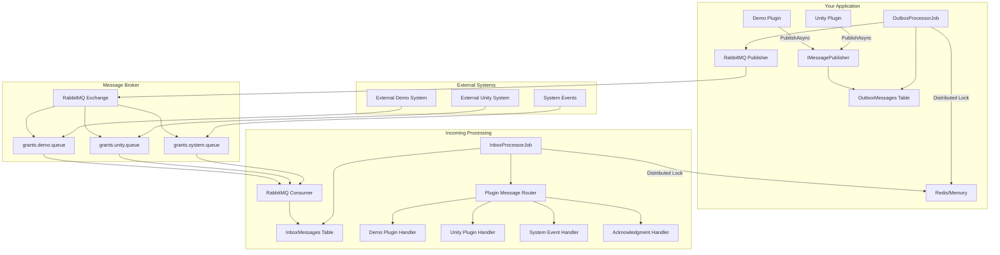

# Messaging System - Plugin Integration Guide

## ?? **Overview**

This messaging system provides **reliable, asynchronous communication** between your application and external systems using the **Inbox/Outbox pattern**. It's designed to work seamlessly with all plugins and handle various message types including acknowledgments.

## ??? **Architecture**



## ?? **Message Flow**

### **Outbound Messages (Plugin ? External System)**

1. **Plugin Action**: Plugin calls `IMessagePublisher.PublishAsync()`
2. **Outbox Storage**: Message stored in `OutboxMessages` table (transactional safety)
3. **Background Processing**: `OutboxProcessorJob` processes messages with distributed locking
4. **RabbitMQ Publishing**: Message sent to appropriate exchange with routing key
5. **External Receipt**: External system receives and processes the message

### **Inbound Messages (External System ? Plugin)**

1. **External Send**: External system publishes message to RabbitMQ queue
2. **Consumer Receipt**: `RabbitMQConsumer` receives message from queue
3. **Inbox Storage**: Message stored in `InboxMessages` table (duplicate detection)
4. **Background Processing**: `InboxProcessorJob` processes with distributed locking
5. **Plugin Routing**: Message routed to appropriate plugin or system handler

## ?? **Message Types & Routing**

### **Outbound Routing Pattern**
```
grants.{plugin}.{messagetype}
```

**Examples:**
- `grants.demo.profileupdated` - Demo plugin profile update
- `grants.unity.contactcreated` - Unity plugin contact creation
- `grants.system.healthcheck` - System health check

### **Inbound Message Types**

#### **1. Plugin Data Messages**
```json
{
  "messageId": "123e4567-e89b-12d3-a456-426614174000",
  "messageType": "ProfileUpdatedMessage",
  "correlationId": "profile-456",
  "pluginId": "UNITY",
  "data": {
    "profileId": "456",
    "provider": "PROGRAM1",
    "key": "ORGINFO"
  }
}
```

#### **2. Acknowledgment Messages**
```json
{
  "messageId": "987f6543-e21b-34c5-b789-123456789abc", 
  "messageType": "MessageAcknowledgment",
  "correlationId": "profile-456",
  "pluginId": "UNITY",
  "data": {
    "originalMessageId": "123e4567-e89b-12d3-a456-426614174000",
    "status": "SUCCESS|FAILED|PROCESSING",
    "timestamp": "2024-01-15T10:30:00Z",
    "details": "Profile successfully updated in external system"
  }
}
```

#### **3. System Events**
```json
{
  "messageId": "abc12345-f678-90gh-ijkl-mnopqrstuvwx",
  "messageType": "SystemEventMessage", 
  "correlationId": "system-event-001",
  "pluginId": "SYSTEM",
  "data": {
    "eventType": "MAINTENANCE_WINDOW",
    "description": "System maintenance starting at 2 AM",
    "scheduledTime": "2024-01-16T02:00:00Z"
  }
}
```

## ?? **Plugin Integration**

### **Sending Messages from Plugins**

```csharp
public class UnityProfilePlugin : IProfilePlugin
{
    private readonly IMessagePublisher _messagePublisher;

    public async Task UpdateProfileAsync(ProfileData data)
    {
        // Do the work...
        await UpdateExternalSystem(data);
        
        // Fire message - reliable delivery guaranteed
        await _messagePublisher.PublishAsync(new ProfileUpdatedMessage(
            data.ProfileId, 
            "UNITY", 
            data.Provider, 
            data.Key,
            correlationId: $"profile-{data.ProfileId}"));
    }
}
```

### **Handling Incoming Messages for Plugins**

```csharp
public class UnityAcknowledgmentHandler : IMessageHandler<MessageAcknowledgment>
{
    private readonly ILogger<UnityAcknowledgmentHandler> _logger;
    private readonly IUnityProfilePlugin _unityPlugin;

    public async Task<Result> HandleAsync(MessageAcknowledgment message, MessageContext context)
    {
        // Only handle acknowledgments for Unity plugin
        if (message.PluginId != "UNITY") 
            return Result.Success();

        switch (message.Data.Status)
        {
            case "SUCCESS":
                await _unityPlugin.HandleSuccessfulUpdate(message.Data.OriginalMessageId);
                break;
            case "FAILED": 
                await _unityPlugin.HandleFailedUpdate(message.Data.OriginalMessageId, message.Data.Details);
                break;
            case "PROCESSING":
                await _unityPlugin.HandleProcessingUpdate(message.Data.OriginalMessageId);
                break;
        }
        
        return Result.Success();
    }
}
```

## ?? **Message Correlation & Acknowledgments**

### **How Correlation Works**

1. **Outbound**: Plugin sends message with `correlationId: "profile-123"`
2. **External Processing**: External system processes and sends acknowledgment
3. **Inbound**: Acknowledgment arrives with same `correlationId: "profile-123"`
4. **Routing**: System matches correlation ID to route acknowledgment to correct plugin

### **Plugin Acknowledgment Handling**

```csharp
public interface IPluginMessageHandler
{
    /// <summary>
    /// Plugin ID that this handler supports
    /// </summary>
    string PluginId { get; }
    
    /// <summary>
    /// Handle acknowledgment for a message sent by this plugin
    /// </summary>
    Task<Result> HandleAcknowledgmentAsync(MessageAcknowledgment ack, MessageContext context);
    
    /// <summary>
    /// Handle incoming data message for this plugin
    /// </summary>
    Task<Result> HandleIncomingMessageAsync(IMessage message, MessageContext context);
}
```

## ?? **Message Tracking & Monitoring**

### **Outbox Monitoring**
```sql
-- Check outbound message status
SELECT PluginId, MessageType, Status, COUNT(*) as Count
FROM OutboxMessages 
GROUP BY PluginId, MessageType, Status;

-- Check failed messages
SELECT * FROM OutboxMessages 
WHERE Status = 2 AND RetryCount >= 5;
```

### **Inbox Monitoring** 
```sql
-- Check inbound message status
SELECT MessageType, Status, COUNT(*) as Count
FROM InboxMessages
GROUP BY MessageType, Status;

-- Check unprocessed acknowledgments
SELECT * FROM InboxMessages
WHERE MessageType = 'MessageAcknowledgment' 
AND Status = 0;
```

## ??? **Configuration**

### **Basic Setup (appsettings.json)**
```json
{
  "Messaging": {
    "RabbitMQ": {
      "HostName": "rabbitmq-server",
      "Port": 5672,
      "UserName": "grants_user",
      "Password": "grants_password",
      "DefaultExchange": "grants.messaging",
      "DefaultQueue": "grants.messaging.inbox"
    },
    "Outbox": {
      "PollingIntervalSeconds": 30,
      "BatchSize": 100,
      "MaxRetries": 5
    },
    "Inbox": {
      "PollingIntervalSeconds": 15, 
      "BatchSize": 50,
      "MaxRetries": 3
    }
  }
}
```

### **Plugin-Specific Queues**
You can configure dedicated queues per plugin for better isolation:

```json
{
  "Messaging": {
    "PluginQueues": {
      "DEMO": "grants.demo.inbox",
      "UNITY": "grants.unity.inbox", 
      "SYSTEM": "grants.system.inbox"
    }
  }
}
```

## ?? **Deployment Scenarios**

### **Development** 
- **Distributed Lock**: In-Memory (single pod)
- **RabbitMQ**: Optional (simulation mode if not available)
- **Redis**: Optional (falls back to in-memory caching)

### **Production**
- **Distributed Lock**: Redis (multi-pod safe)
- **RabbitMQ**: Required (external message integration)  
- **Redis**: Required (distributed caching)

## ?? **Plugin Development Guide**

### **1. Add Message Publisher to Plugin**
```csharp
public class MyPlugin : IProfilePlugin
{
    private readonly IMessagePublisher? _messagePublisher;
    
    public MyPlugin(ILogger<MyPlugin> logger, IMessagePublisher? messagePublisher = null)
    {
        _logger = logger;
        _messagePublisher = messagePublisher; // Nullable for graceful degradation
    }
}
```

### **2. Send Messages from Plugin**
```csharp
await _messagePublisher?.PublishAsync(new MyCustomMessage(
    someId, 
    PluginId, 
    correlationId: $"operation-{someId}"));
```

### **3. Create Message Handlers**
```csharp
public class MyPluginAckHandler : IMessageHandler<MessageAcknowledgment>
{
    public async Task<Result> HandleAsync(MessageAcknowledgment message, MessageContext context)
    {
        if (message.PluginId != "MYPLUGIN") return Result.Success();
        
        // Handle acknowledgment logic
        return Result.Success();
    }
}
```

### **4. Register Handlers**
```csharp
// In MessagingServiceExtensions.cs
services.AddScoped<IMessageHandler<MessageAcknowledgment>, MyPluginAckHandler>();
```

## ?? **Error Handling & Reliability**

### **Message Delivery Guarantees**
- ? **At-least-once delivery** for outbound messages
- ? **Duplicate detection** for inbound messages  
- ? **Retry with exponential backoff** for failed messages
- ? **Dead letter handling** for permanently failed messages

### **Failure Scenarios**
1. **Database Down**: Messages queued in RabbitMQ until service recovery
2. **RabbitMQ Down**: Messages remain in outbox for retry when restored
3. **Plugin Error**: Message marked as failed with retry logic
4. **External System Down**: Acknowledgments delayed but tracked

## ?? **Performance Tuning**

### **Outbox Performance**
- **Batch Size**: Increase for higher throughput, decrease for lower latency
- **Polling Interval**: Faster polling = lower latency, higher CPU usage
- **Max Retries**: Balance between reliability and resource usage

### **Inbox Performance**
- **Consumer Concurrency**: Multiple consumers for high volume
- **Message Partitioning**: Route different plugins to different queues
- **Handler Optimization**: Async processing, minimal blocking operations

## ?? **Security Considerations**

### **Message Security**
- **Authentication**: RabbitMQ user credentials
- **Authorization**: Queue/exchange permissions 
- **Encryption**: TLS for RabbitMQ connections
- **Message Validation**: Schema validation for incoming messages

### **Plugin Isolation**
- **Correlation ID Validation**: Prevent cross-plugin message handling
- **Plugin Authentication**: Verify message sender identity
- **Resource Limits**: Per-plugin message rate limiting

---

## ?? **Getting Started**

1. **Configure RabbitMQ** connection in appsettings
2. **Run database migration** to create message tables
3. **Register message handlers** for your plugins
4. **Start sending messages** from plugins using `IMessagePublisher`
5. **Monitor message flow** using database queries and logs

The system is designed to **work out of the box** with minimal configuration and **gracefully degrade** when external dependencies are unavailable.