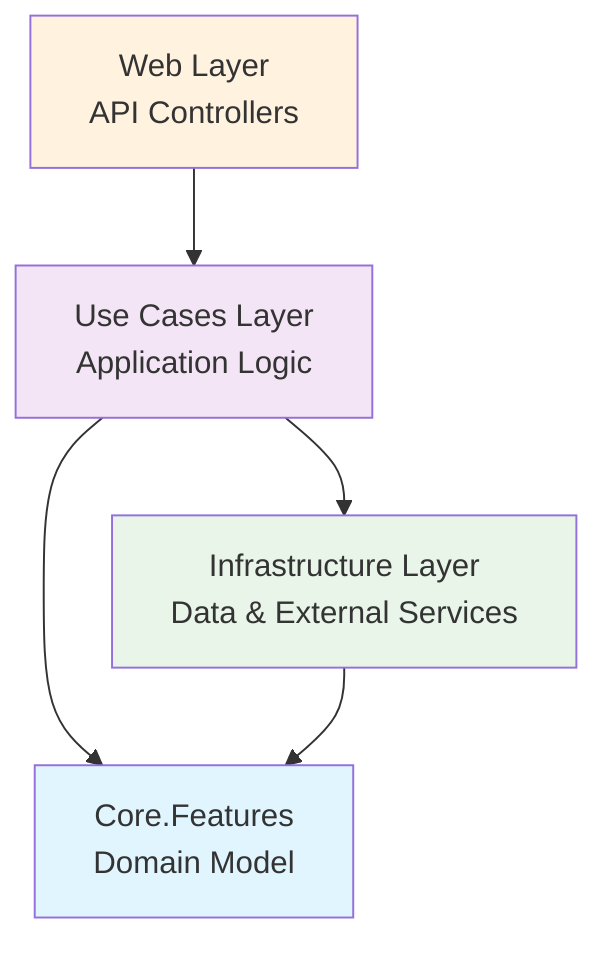
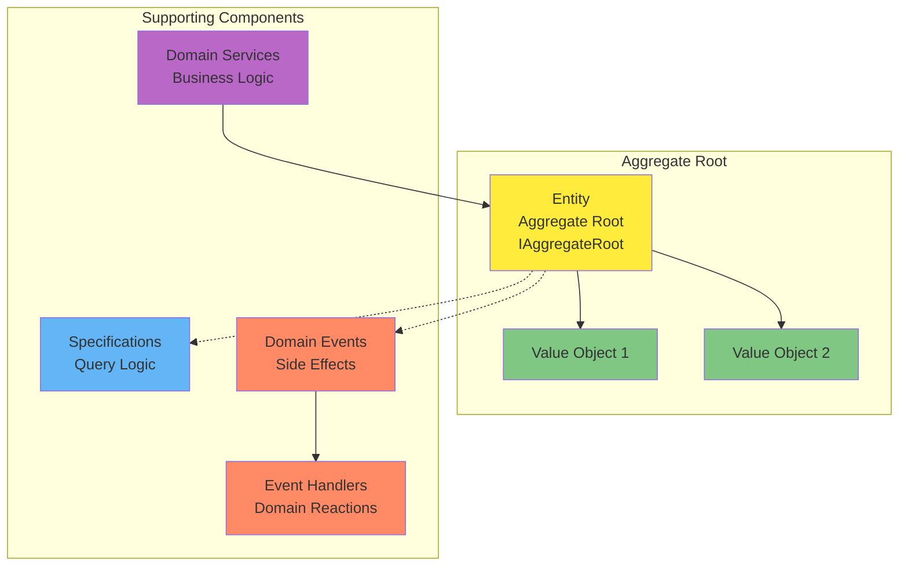
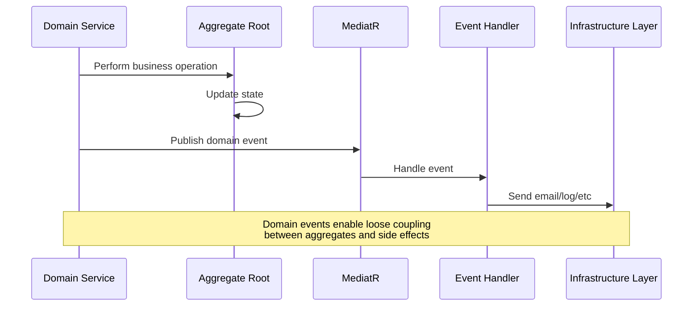
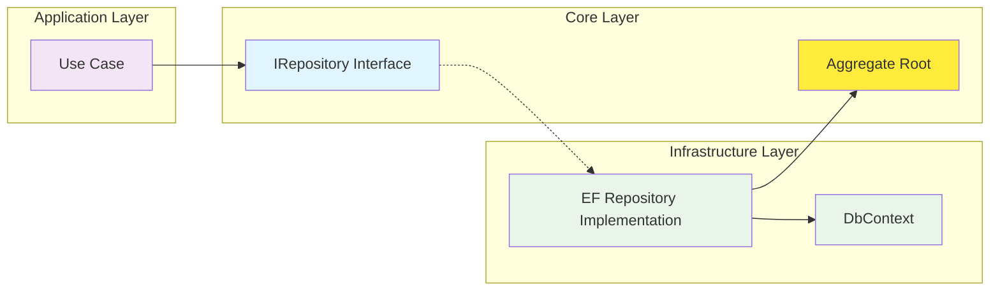
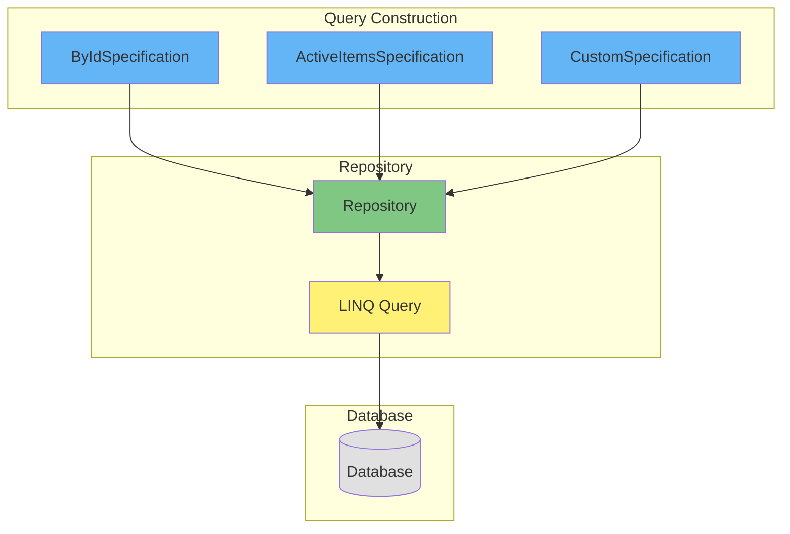

## Core Project + Core.Features (Domain Model)

In Clean Architecture, the central focus should be on Entities and business rules.

In Domain-Driven Design, this is the Domain Model.

This project should contain all of your Entities, Value Objects, and business logic.

Entities that are related and should change together should be grouped into an Aggregate.

Entities should leverage encapsulation and should minimize public setters.

Entities can leverage Domain Events to communicate changes to other parts of the system.

Entities can define Specifications that can be used to query for them.

For mutable access, Entities should be accessed through a Repository interface.

Read-only ad hoc queries can use separate Query Services that don't use the Domain Model.

## Architecture Overview

This project follows Clean Architecture and Domain-Driven Design principles. The following diagrams illustrate the key patterns and structures:

### Clean Architecture Layers

### Aggregate Structure

### Domain Event Flow

### Repository Pattern

### Specification Pattern

## Key Patterns Implemented

### 1. Aggregate Pattern
- **Aggregate Root**: Main entity that enforces business rules
- **Value Objects**: Immutable objects that describe aspects of the domain
- **Encapsulation**: Private setters with public methods for state changes

### 2. Domain Events
- **Event Publishing**: Aggregates publish events when state changes
- **Event Handlers**: React to domain events with side effects
- **Loose Coupling**: Events decouple business logic from infrastructure concerns

### 3. Specifications
- **Query Logic**: Encapsulate complex query logic in reusable specifications
- **Repository Integration**: Use specifications with repository pattern
- **Testability**: Specifications make query logic unit testable

### 4. Domain Services
- **Cross-Aggregate Operations**: Handle operations that span multiple aggregates
- **Complex Business Rules**: Implement domain logic that doesn't belong in a single entity
- **Event Coordination**: Orchestrate domain events across operations

## Current Domain Model

The project currently contains the following aggregates:

### Profile Aggregate
- **Profile**: Main entity representing a user profile in the system
- **Purpose**: Manages user identity and authentication data
- **Location**: `Profiles/ProfileAggregate/`

## Implementation Guidelines

1. **New Aggregates**: Create new aggregates following the Profile pattern
2. **Value Objects**: Use for concepts that don't have identity (like addresses, money, etc.)
3. **Domain Events**: Publish events for significant business state changes
4. **Specifications**: Create specifications for complex queries
5. **Domain Services**: Use for operations that don't fit in a single aggregate

## Examples and Resources

Need help? Check out the sample here:
https://github.com/ardalis/CleanArchitecture/tree/main/sample

Still need help?
Contact us at https://nimblepros.com
